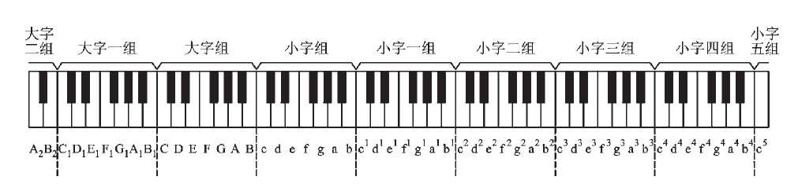

## 什么是音乐

音乐是通过组织音来构成一种的听觉意象，用以表达人们的思想感情的一种艺术形式。而乐理就是精准描述音乐现象的理论方式，是音乐家之间交流的通用语言。

## 音与音的基本属性

震动产生声音，在物理上震动的频率高低用赫兹表示，震动的太快或者太慢产生的声音人的耳朵都听不到，人耳能听到的一般为20Hz至20000Hz，这些才是音乐中用的音。

这些音又分为乐音和噪音，它们都具有音长、音量、音色这三个属性。乐音是由有规则的震动产生的，只有一个最明显且较稳定的频率，而噪音是由不规则的震动或无明显规则的震动产生的，噪音有很多个不稳定的频率，所以乐音还有第四个属性叫音高(也就是频率)。音长是时值，指音持续的时间；音量也称响度，由震动的幅度大小决定；音色由发音体的形状、震动方式、材料和发音体的品质等决定。

## 音级

我们所熟知的多数音乐是建立在西洋大小调体系上的基本乐理，钢琴就是为这个体系发明的乐器，它包含了大小调体系中所有的音高。

钢琴键盘是有规律的，口诀为"三白夹两黑，四白夹三黑，两黑左边白，音名就是C"。

音级就是音乐中使用的每个单独的乐音，基本音级就是具有独立名称的音级(也就是CDEFGAB，也就是钢琴中的白键)。键盘上那么多键可以分为不同的音组，每个音组中包含了基本音级，除了大字二组和小字五组，其他音组都是完整音组包含了所有的基本音级。如图所示:

小字一组是钢琴最中央的一个音组，其中的c1又称为中央C，a1为标准音(440Hz)是国际上通行的定音音高。只有在需要区分不同音组的情况下，我们才会用音组标记的方式来称呼某个音，其他情况都是直接称呼音名，描述多个音名时通常高音在后，例如CD就表示同组的，而DC则表示当前组的D和下一个组的C。

为了在电脑里表示方便，出现了另一种音组标记的方法。大字二组对应A0~B0，其次是C1~B1，C2~B2，C3~B3，C4~B4，C5~B5，C6~B6，C7~B7以及小字五组的C8。这种表示方法下，中央C是C4。