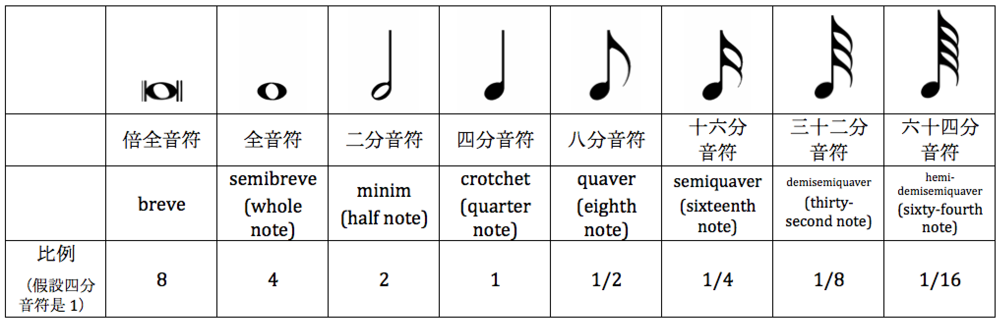

## 什么是音乐

音乐是通过组织音来构成一种的听觉意象，用以表达人们的思想感情的一种艺术形式。而乐理就是精准描述音乐现象的理论方式，是音乐家之间交流的通用语言。

## 音与音的基本属性

震动产生声音，在物理上震动的频率高低用赫兹表示，震动的太快或者太慢产生的声音人的耳朵都听不到，人耳能听到的一般为20Hz至20000Hz，这些才是音乐中用的音。

这些音又分为乐音和噪音，它们都具有音长、音量、音色这三个属性。乐音是由有规则的震动产生的，只有一个最明显且较稳定的频率，而噪音是由不规则的震动或无明显规则的震动产生的，噪音有很多个不稳定的频率，所以乐音还有第四个属性叫音高(也就是频率)。音长是时值，指音持续的时间；音量也称响度，由震动的幅度大小决定；音色由发音体的形状、震动方式、材料和发音体的品质等决定。

## 音级

我们所熟知的多数音乐是建立在西洋大小调体系上的基本乐理，钢琴就是为这个体系发明的乐器，它包含了大小调体系中所有的音高。

钢琴键盘是有规律的，口诀为"三白夹两黑，四白夹三黑，两黑左边白，音名就是C"。

音级就是音乐中使用的每个单独的乐音，基本音级就是具有独立名称的音级(也就是CDEFGAB，也就是钢琴中的白键)。键盘上那么多键可以分为不同的音组，每个音组中包含了基本音级，除了大字二组和小字五组，其他音组都是完整音组包含了所有的基本音级。如图所示:

小字一组是钢琴最中央的一个音组，其中的c1又称为中央C，a1为标准音(440Hz)是国际上通行的定音音高。只有在需要区分不同音组的情况下，我们才会用音组标记的方式来称呼某个音，其他情况都是直接称呼音名，描述多个音名时通常高音在后，例如CD就表示同组的，而DC则表示当前组的D和下一个组的C。

为了在电脑里表示方便，出现了另一种音组标记的方法。大字二组对应A0~B0，其次是C1~B1，C2~B2，C3~B3，C4~B4，C5~B5，C6~B6，C7~B7以及小字五组的C8。这种表示方法下，中央C是C4。

## 五线谱

五线谱是将音乐用图形记录下来的一种方式，世界范围内通行程度最高，也称为五线谱表。

它的五条线从下到上代表着音高的从低到高，命名为一线、二线、三线、四线、五线。当我们说音符在第几线时，它一定是要被这条线穿过。五条线之间的部分被称为一间、二间、三间、四间。如果五条线不够，需要更高或更低时，我们也可以加线加间，五线之上天然存在一个间叫上加一间，我们可以接着划线就构成上加一线、上加二间、上加二线、上加三线，同理也就有下加一间、下加一线、下加二间、下加二线等。如图:

如果一个音符在上(下)加N间，且此位置没有其他音比它的位置更高(低)，那么不需要在添加上(下)加N线。

对于先后出现的两个音符，它们加的线不能连起来。

有了五条线，我们就能标记音高了吗？实际上我们还需要谱号，谱号规定了五线谱表与音的对应关系，没有谱号的谱表不能表示音高，还有一些特殊的谱号是用来表示音符与某种乐器的关联，也不能表示音高。常见的有三种谱号，高音谱号对应着高音谱表，也叫G谱表，此时的中央C在下加一线；低音谱号对应着低音谱表，也叫F谱表，中央C在上加一线；中音谱号对应中音谱表，也叫C谱表，中央C在三线。谱号的作用范围到下一个谱号出现或者行尾。选择合适的谱表是为了减少加线或者加间的概率。  

## 黑键
以CD之间的黑键为例，它会把CD的音高一分为二，我们把它称为半音，半音是最基本的音高单位，钢琴中任意相邻的两个键即为半音。CD之间的这个黑键，是把C升高了半音，可以记为#C，即升C，也是把D降低半音，也可记为bD，即降D。我们把#C和bD称为等音，即音高相同，记法和意义不同的音。

钢琴上的黑键都是把基本音级升高或降低半音，也称为变化音级。而钢琴上的EF和BC之间没有黑键也是半音的关系。那么基本音级之间的关系就是`全全半全全全半`。

未经升降的基本音级，我们可以称它为本位音，改变基本音级的高度就需要变音记号。

* 升号`♯`表示将本位音升高半音
* 重升号`x`表示将本位音升高全音
* 降号`♭`表示将本位音降低半音
* 重降号`♭♭`表示将本位音降低全音
* 还原记号`♮`可以还原本位音的高度

变音记号对某个音符之后的一行都是起作用的，所以我们使用变音记号时就要确认这条线之前不曾出现过变音记号，如果有就需要加还原记号。它们的规则如下:

* 变音记号在一小节的范围内生效，如果没有小节先，就在一整行中生效
* 变音记号及还原记号只作用于它所在位置右侧的线或间
* 变音记号只相对于本位音做升级变化，不叠加
* 为音名或唱名使用的变音记号，只对其后一个音有效，没有变音记号的音名表示本位音，不需要加还原记号

## 时值
音乐是时间的艺术。时间对音乐的重要性甚至超过了音高，有的打击乐我们不在乎它的音高，更在乎它的节奏。

我们可以想象一下时钟，指针旋转一周代表一个循环，那就可以用这样一个循环来表示一个全音符的长度，那么半个循环就是二分音符，再次等分就是四分音符...八分音符...十六分音符等等。

由于四分音符算是一个比较中间的音符，我们大多数情况用它来做为一个基本单位，例如使用120个四分音符/分钟来标记一首曲子，那么每个四分音符就持续半秒，每个全音符就持续两秒。

音符在五线谱中的高低位置决定了音高，它的外形决定了时值，音符的左右位置决定了它的先后演奏顺序，有了这三点我们就可以把有长有短、有高有低、有先有后的音符组织成旋律了:

相邻的带符尾的音符可以按照一定规则将符尾连接起来:

时值的长短关键还是看它是什么样的音符，而不看它占了谱子上多大的地方。

我们通常用`[音符]=[数字]`来表示音乐的速度，公式中的音符为单位拍，数字为每分钟之内单位拍的数量。